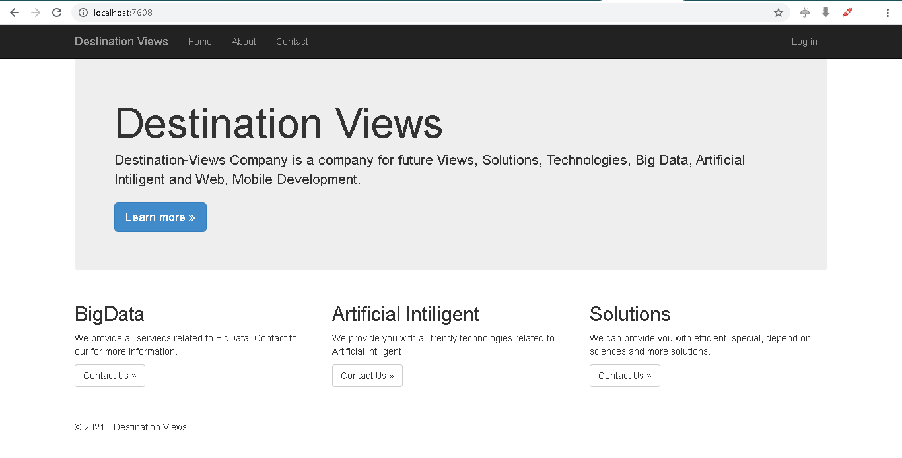
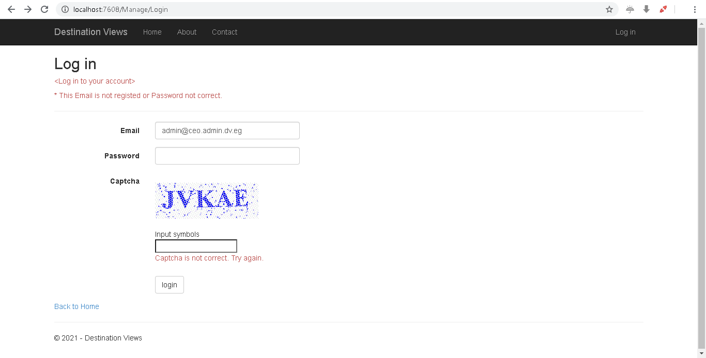
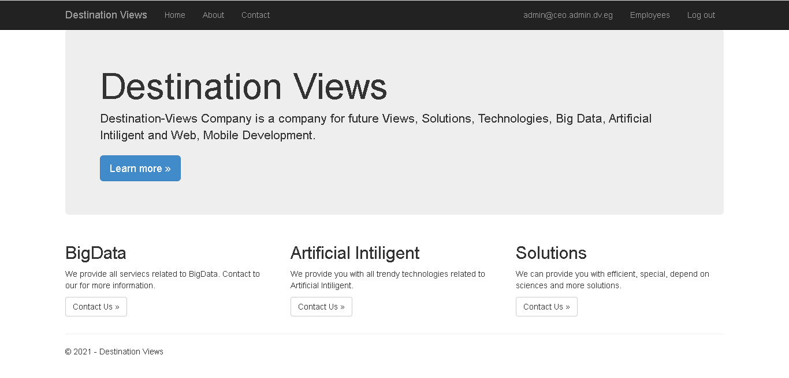
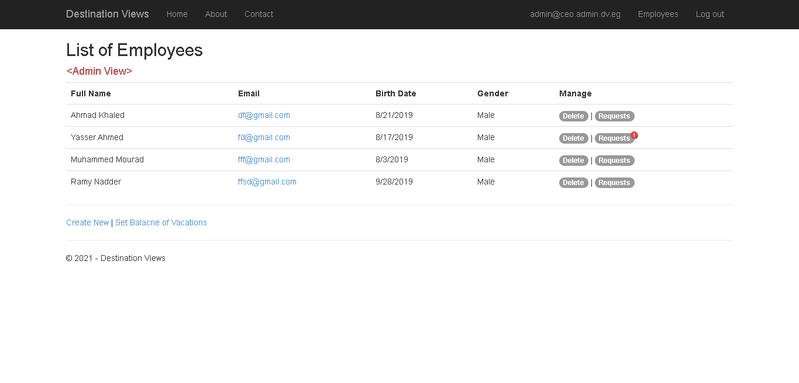
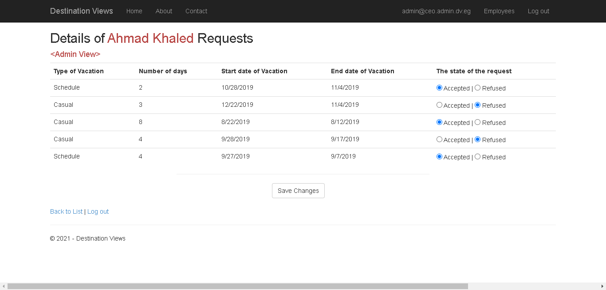

# Company-Vacation-System
This Web application built using ASP.NET with MVC design pattern. This Web app provides a **Vacation System** that provides to the adminstrator a cople of freatures as the following:
1. Login Panal
2. Adminstrator specific view
3. Employees list
4. employees vacation requests
5. and other embeded features

# Screenshots:
1. Home Page

2. Login Panel

3. After login

4. Employees list

5. Request vacation list of employee

6. Balance setter

